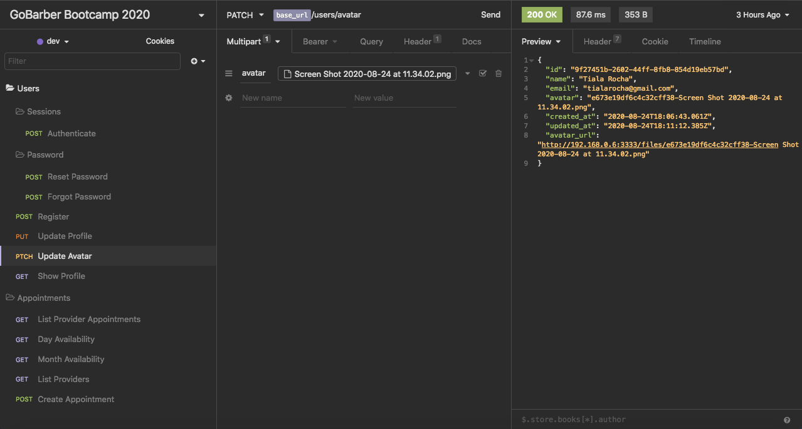
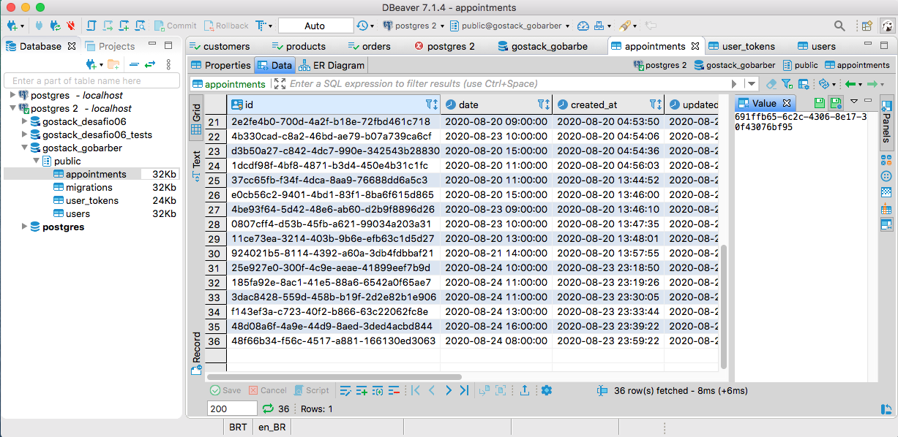
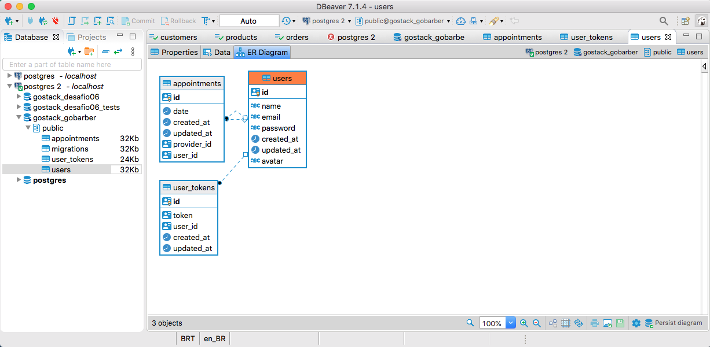

<h1>🚀  GoBarber Back-end</h1>

This application allows customers (users who want to receive assistance related to the barber shop in question) and service providers (users who provide services to the barber shop) in the scope of authentication to perform the login, registration and password recovery.

Within the application it is possible for customers to view the service providers in the barbershop and make an appointment for a specific date and time.

The service providers are presented in a list, as well as their respective schedules available for appointments.

Schedules directed to providers are presented as a list according to the afternoon or morning shift filtered by the selected day, month and year.

Users (providers or customers) will also be able to change their registration data and insert an avatar to their profile.

- Front-end Web: https://github.com/tialaR/GoBarber-Web-Bootcamp-Rocketseat
- Front-end Mobile: https://github.com/tialaR/GoBarber-Mobile-Bootcamp-Rocketseat

 

 

 

